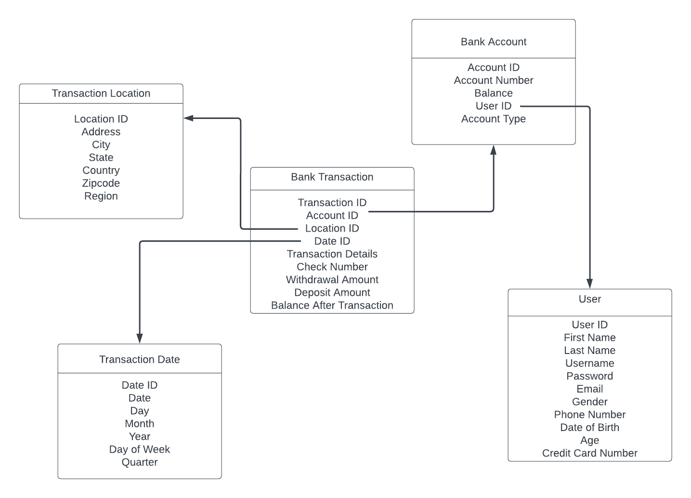

# DSProject1
Madelyn and Tiara's midterm project for DS Systems.

## Business Process

We have elected to use bank transactions (deposits and withdrawals) as the core business process for our data warehouse. Thus, the fact table will involve bank transactions, while a number of dimension tables will provide additional information about the account involved in the transaction, the customer who completed the transaction, the date of the transaction, and the location in which the transaction occurred.

## Database Schema

The schema of this data warehouse follows a star/snowflake design, since this is an OLAP database centered around the bank transaction table, which is the fact table. Figure 1 shows the complete schema.

